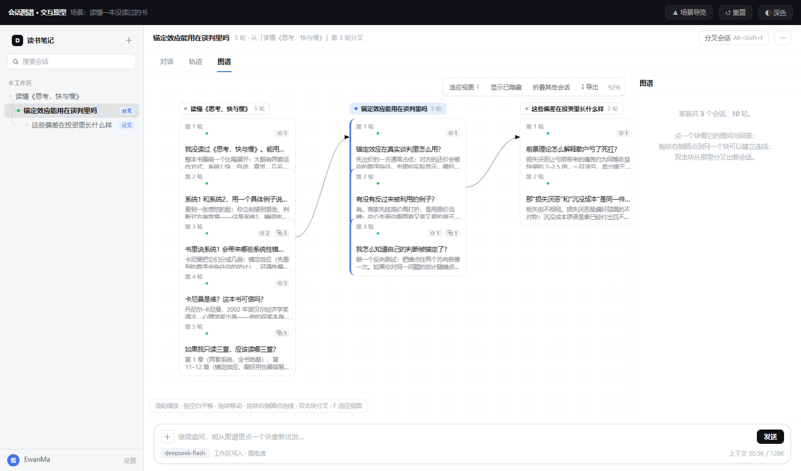
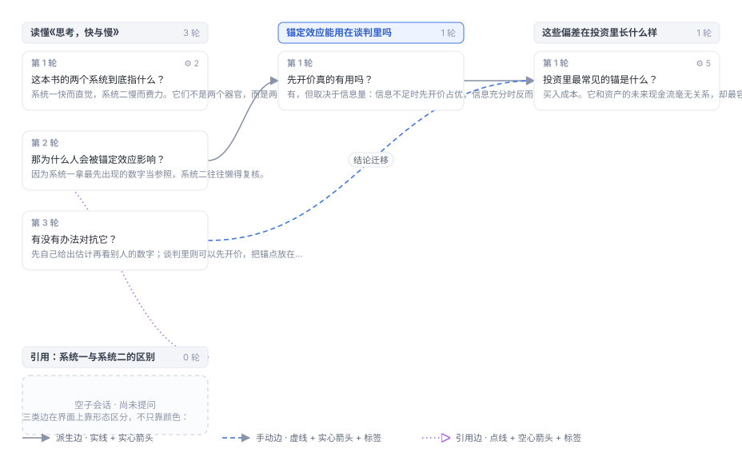
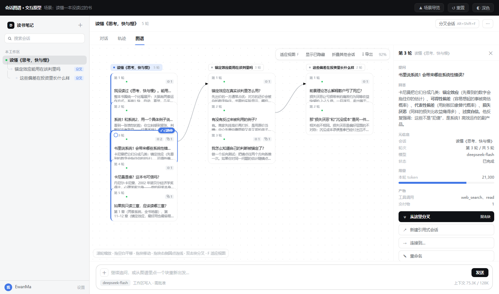
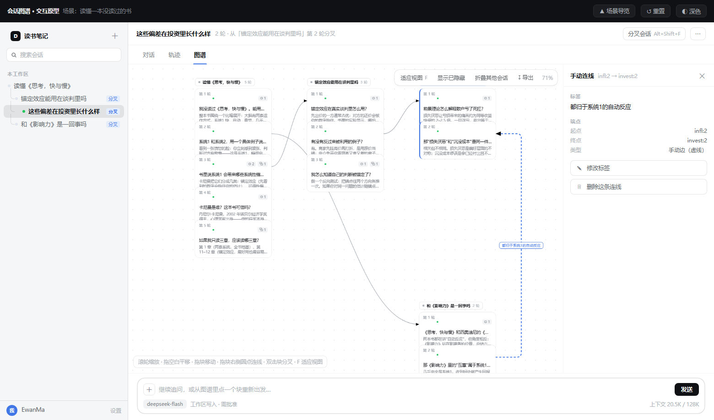
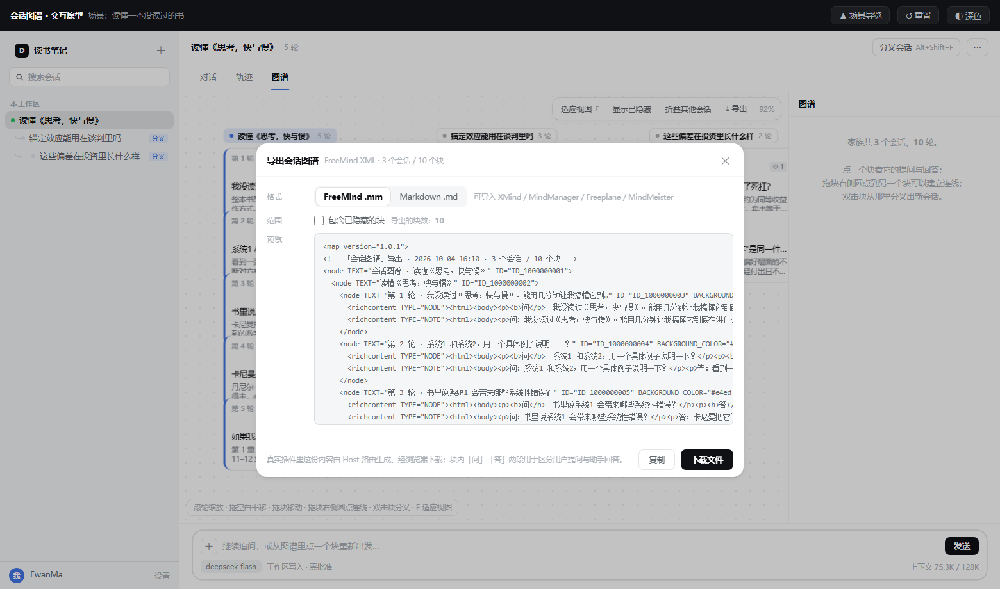
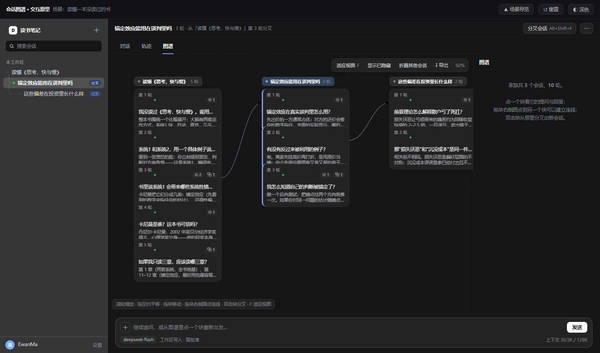

# 会话图谱 · Session Graph

**给 [DeepSeek Harness](https://github.com/deepseek-ai)（DSH）用的会话分叉图谱插件**：把一条直线对话变成一张可以点、可以连、可以导出的图。
一轮交互是一个块；任意块都能**从这里分叉**出新会话；散落在不同分支上的结论可以用**连线**接起来；整张图能**导出**成 XMind / Freeplane / MindManager 认得的思维导图。

<sub>[English summary ↓](#english-summary) · [功能](#功能) · [安装](#安装) · [用法](#用法) · [导出](#导出一个块--一个节点节点内区分问答) · [工作原理](#工作原理) · [开发](#开发) · [完成度与已知偏差](#完成度与已知偏差) · [实现说明与 DSH 的契约](#实现说明与-dsh-的契约) · [常见问题](#常见问题) · [参与贡献](#参与贡献)</sub>

[](./LICENSE)
[](#安装)
[](#工作原理)
[](#开发)
[](#参与贡献)

**关键词**：DeepSeek Harness 插件 · DSH plugin · 会话图谱 · 对话图谱 · 会话树 / 对话树 · 对话分叉 · 会话分支 · 对话分支 · 聊天记录可视化 · 思维导图导出 · FreeMind `.mm` · Markdown `.md` · XMind · Freeplane · MindManager · 归档不进图。



> **界面截图由插件的交互原型渲染而来**，不是"某台机器上的产品截图"：
> 脚本把原型放进无头浏览器、逐个场景设好状态再截图，因此可以随原型演进重新生成，不会像截图那样过期。

```
   会话头 ──┬── 第1轮 ── 第2轮 ──┯── 第3轮 ── 第4轮
            │                   │
            │                   └── ⑂ 子会话 ── 第1轮 ── 第2轮
            │
            └── 第1轮 ── 第2轮        ← 另一条分支（会话头独立成列）
```

竖排是同一个会话的先后轮次，向右是分叉出去的子孙，实线是派生关系。



> 上面这张图不是界面截图，而是**用插件自己的装配、布局与几何代码渲染出来的**：
> 同一份 `buildGraph` / `layout` / `edgePath` 就是界面上跑的那几个函数。
> 它可以随代码重新生成（`node scripts/make-preview.mjs`），不会像截图那样过期。
> 图里的颜色是字面量，因为这张图不在宿主里、拿不到主题变量；界面本身只用主题变量。

---

## English summary

**Session Graph is a plugin for [DeepSeek Harness](https://github.com/deepseek-ai) (DSH) that turns a linear chat history into a navigable graph.**
It adds a third conversation view, next to _Chat_ and _Trace_, which lays out a whole session family — the session itself, its ancestors, and every fork — as columns of blocks. One turn is one block. Select any block and fork a new session from that exact turn boundary; connect blocks across branches to record "conclusion B builds on A"; hide dead ends; and export the whole graph to FreeMind `.mm` or Markdown `.md` for XMind, Freeplane, or MindManager.

- **Session branching from any turn** — fork at that turn's end boundary, with the full inherited history; inherited turns are not redrawn (they already have blocks in the source session).
- **Graph view** — sessions as columns, turns stacked downwards, forks running rightwards; archived sessions stay out of the graph entirely.
- **Manual links** — connect any two blocks to express cross-branch relationships; labels are editable and deletable in place.
- **Hide & undo** — fold away dead ends (their links disappear with them), step back with `Ctrl+Z`.
- **Persistence** — hidden blocks, aliases, links, manual layout, and the viewport live in the host storage domain and survive restarts.
- **Localization** — every string comes from the host locale service (`zh` / `en`), with number formatting per language.
- **Export** — one block is one node, with the question and the answer separated inside that node in three fallback layers, so no viewer loses content.
- **Zero dependencies, pure JavaScript** — a host half contributing one fetch route and a prebuilt client half; nothing is built at install time.

Requires DeepSeek Harness `0.2.0-rc.2` or a later version in the same minor.

---

## 目录

- [这个插件解决什么](#这个插件解决什么)
- [功能](#功能)
- [安装](#安装)
- [用法](#用法)
- [导出：一个块 = 一个节点，节点内区分问答](#导出一个块--一个节点节点内区分问答)
- [工作原理](#工作原理)
- [开发](#开发)
- [完成度与已知偏差](#完成度与已知偏差)
- [实现说明与 DSH 的契约](#实现说明与-dsh-的契约)
- [常见问题](#常见问题)
- [参与贡献](#参与贡献)
- [许可证](#许可证)

---

## 这个插件解决什么

对话是线性的，追问不是。

想问清楚一本书，你会连着追五轮；追到第三轮时发现"锚定效应"值得单独挖一条线，于是分叉；分叉线里又冒出一个投资方向，再分一层。等回头看，**前面问过什么、哪条线是结论、哪句话被哪条线引用过，全乱了**：

- 聊天记录只有一条时间轴，分叉出去的内容**和主线挤在一起**；
- 找不到"这句话是在哪一轮得出来的"，也说不清两条线之间的依赖；
- 想把这些理清楚带走 —— 打开 XMind 却发现**没有地方能粘贴一棵对话树**。

会话图谱把这条时间轴换成一张图：**轮次是块，分叉是列，结论之间的依赖是连线**，而整张图可以导出成一个真正的思维导图文件。

---

## 功能

| | |
|---|---|
| **图谱视图** | 与「对话」「轨迹」并列的第三个视图；整族会话（自己 + 祖先 + 所有分叉）一起出现 |
| **块** | 一轮交互一个块，显示轮次、状态、提问与回答摘要、工具调用与交付物计数；轮次号是**会话内序号**（子会话从它自己新问的第一轮起数） |
| **分叉** | 选中块后点「⑂ 从这里分叉」，从那一轮的结束边界切出一条新会话（**没有双击手势**：建新会话有副作用，不挂在容易误触的默认手势上） |
| **继承不重复** | 分叉带过来的父会话历史**不再画一遍** —— 它在源会话里已经各有一份块，子会话只留新问的内容 |
| **归档不进图** | 已归档的会话不画卡片、不建立任何关联（挂在它下面的分支降级为根并说明原因），图角报出条数 |
| **连线** | 手动把两个块接起来，表达"结论 B 建立在 A 之上"这类跨分支关系 |
| **隐藏** | 把探索过程中的死胡同折叠起来；被隐藏块的连线一并消失，导出时记录跳过数量 |
| **导出** | FreeMind `.mm` 与 Markdown `.md`，可直接导入 XMind / Freeplane / MindManager |

### 从一轮分叉



*选中任意一块，右栏给出这一轮的完整提问、回答、元信息与用量，「⑂ 从这里分叉」就在下面。*

### 把结论接起来



*手动连线用**虚线 + 实心箭头**，引用边用**点线 + 空心箭头** —— 三类边靠形态区分，不只靠颜色。*

### 导出



*选格式、看预览、下载；导出的块数与当前图谱一致。*

### 深色主题



*界面只使用宿主的 `--dsw-alias-*` 主题变量，深浅色与产品其余部分一致。*

---

## 安装

要求 DeepSeek Harness `0.2.0-rc.2` 或同一 minor 的更高版本。

1. 打开 Web 界面左侧栏的 **插件** 页
2. 点 **安装插件**，填入本仓库地址：
   ```
   https://github.com/EwanMa0821/dsh-plugin-session-graph
   ```
   （也可以填本地目录的绝对路径）
3. 安装完成后如果显示为**已停用**，点 **启用**

然后**刷新页面**。图谱是客户端插件，浏览器需要重新取一次模块图才会出现新标签；刷新后仍没有就重启宿主进程。

### 从源码安装

克隆到任意目录，然后在插件页填入该目录的绝对路径。插件**零依赖**，安装过程不会执行任何构建脚本。

---

## 用法

| 操作 | 结果 |
|---|---|
| 点视图标签栏的 **图谱** | 进入图谱，与「对话」「轨迹」并列 |
| 单击块 | 右侧详情：完整提问、完整回答、元信息与操作 |
| 单击连线 | 选中它：右栏改标签、删除该连线。线只有 1.6 像素宽，实际点的是它周围的透明热区 —— **没有标签的连线同样点得中**（悬停时线会加粗） |
| 右栏点「⑂ 从这里分叉」 | 从该轮分叉出新会话（继承到该轮为止的完整历史）。**双击块不再分叉** —— 想选中、想看清文字都会双击，误触就多出一条会话 |
| 拖空白 | 平移视口 |
| **拖块** | 移动块，连线跟随，松手后写入自有布局。**会话头跟着自己最上面那块走**，所以块拖到哪都看得出它属于哪个会话 |
| 滚轮 / 捏合 | 以指针为锚缩放（25%–200%） |
| 双击空白，或按 `F` | 适应视图 |
| 方向键 | 在相邻块之间移动选中，只在按键方向的锥内走 |
| `Esc` | 关闭导出对话框 / 清除选中 |
| 点会话头 | 切换当前会话 |
| **显示已隐藏** | 半透明显示被隐藏的块，连线一并恢复 |
| **折叠其他会话** | 只保留会话头与派生边，用于压密度 |
| **↶ 撤销** / `Ctrl+Z` | 回退上一步（隐藏、重命名、连线的新建与删除） |
| **导出** | 选格式、看预览、下载 |

**进行中的轮次不能分叉。** 日志里没有 `turn/end` 的轮次没有可用的切点，产品自身的分叉动作同样用不了它——
这不是限制，而是不让你切在一个错误的 seq 上。

---

## 导出：一个块 = 一个节点，节点内区分问答

导出结果里**每个块是同一个节点**，节点内部用三层保底区分用户提问与助手回答——
同一份文本，任何一层都不缺内容：

| 层 | `.mm` 里的表现 | 谁会用到 |
|---|---|---|
| 1 | `richcontent TYPE="NODE"`：`<p><b>问</b>…</p><p><b>答</b>…</p>` | Freeplane / XMind / MindManager 直接看到两段 |
| 2 | `richcontent TYPE="NOTE"`：完整问答 + 元信息 | 大多数工具显示备注，作为保底 |
| 3 | `TEXT` 里的提问截断 | 连备注都不显示的工具至少能看到提问 |

结构映射：

| 图谱 | 导出结果 |
|---|---|
| 分叉出来的会话 | 挂在**它的分叉源块**节点之下（真正的树，不平级） |
| 引用式会话 | 挂在源块之下，加虚线边与书签图标 |
| 手动连线 | `<arrowlink>` 箭头链接 / 文末清单 |
| 别名 | `TEXT` 前置 `✎ `，轮次后括号标注 |
| 隐藏块 | 按选项跳过，跳过数量写进根备注 |

**正文按其原有 Markdown 结构嵌入**，不会被压成一行：

- `.md` 里正文是一个**缩进块**，所以表格、代码围栏、有序列表都能正确渲染
- `.mm` 的 richcontent 是 **HTML 而不是 Markdown**，所以行内标记会转成 `<b>` / `<code>` / `<a>`，
  表格分隔行与 ``` 围栏标记被丢掉，**围栏内的内容原样保留**（代码里的 `a ** b` 不会被误吃）

---

## 工作原理

插件由两半组成，都是**纯 JavaScript，零依赖**。

**Host 半**（`index.js`）只做一件事：贡献一条 Fetch 路由 `/api/session.graph-export`。

- `GET` 返回家族数据（`format=json`）或导出文件（`format=mm|md`）
- `HEAD` 取消响应体，只回状态与响应头——浏览器的下载预检要用
- 参数非法 → 400，依赖服务缺失 → 503

**客户端半**（`client.js`）向 `conversation.view` 槽位注册「图谱」视图，另外注册一个视图数据层，
把装配器的轮次时间线折成快照。

正文一律按 **Markdown** 处理：详情面板直接用宿主的 `MarkdownText` 渲染，与产品其余部分排版一致；
画布上的一行摘要用 `extractMarkdownPlainText` 抽成纯文本。正文在数据层**保留换行**——
表格、代码块、列表全靠它成立，压成一行就全塌了。

`src/` 是唯一真源，分成三层：

```
src/core/model.js    块、边、家族范围、图模型（纯函数）
src/core/graph.js    分层布局、路径、适应视图、键盘导航（纯函数）
src/core/export.js   FreeMind .mm 与 Markdown .md（纯函数）
src/host/fold.js     事件流 → 轮次；按 session/end-seed 标出继承前缀，由继承事件数反推分叉源
src/client/app.js    客户端应用
```

### `client.js` 是生成物

宿主的 `__ModuleLoader__` 以懒加载 CJS 装载客户端产物，里面只能 `require('react')`，
**无法 `import` 本包的 ESM 源码**。所以构建放在作者侧：`scripts/build-client.mjs`
把三个核心模块的 `import/export` 降级后内联，拼成 `client.js`。

发布物是**预构建**的，安装时不跑任何构建脚本。改了 `src/` 必须重新生成，
否则 `check-package.mjs` 会直接判失败。

---

## 开发

```bash
node scripts/run-tests.mjs           # 338 项测试，在同一进程内运行
node scripts/check-package.mjs       # 清单、图标、patch、产物是否过期、服务访问越界
node scripts/check-host-contract.mjs # 宿主契约核对（本机没装 DSH 就自动跳过）
node scripts/build-client.mjs        # 改过 src/ 之后必须跑
node scripts/make-preview.mjs        # 重新生成 README 的示意图 SVG
node scripts/make-screenshots.mjs    # 重新生成 README 的界面截图（需要 Edge / Chrome）
```

测试分五层：`test/core.test.mjs`（纯逻辑）、`test/host.test.mjs`（事件折叠与路由）、
`test/client.test.mjs`（把生成的 `client.js` 装进最小浏览器环境，用带 hook 运行时的小 React
**真渲染一次**，而不是只断言字符串）、`test/state.test.mjs`（存档清洗、补丁合并与撤销）、
`test/scripts.test.mjs`（**门禁脚本自己**：护栏必须抓得住真违规、又放得过注释里的反例）。

三个门禁都在 `.github/workflows/ci.yml` 里跑：单元测试、清单与产物同步、
宿主契约。仓库零运行时依赖，所以 CI 不需要 install 步骤。

### 宿主契约检查为什么值得单独存在

单元测试跑在**假宿主**上，测的是"我们相信的宿主"。这个插件的两次线上级故障
（`dsh.client.immediately` 卡死整个壳、`ctx.workspaces` 未 inject 的属性访问导致白屏）
都不是逻辑错，而是**对宿主契约的假设过期了** —— 那一层单元测试永远够不着。

`scripts/check-host-contract.mjs` 直接读宿主安装里的 `app.asar`，逐条核对：
存储域名的命名规则、`resolveSlotLabel` 会不会兜底、视图槽位与数据层的注册形状、
`immediately` 的引导批次语义、cordis 的 inject 守卫、以及
**我们 inject 的每个服务是否真有产品包在提供**（写错名字 = 永远 pending）。
契约变了它就变红，比线上白屏便宜得多。装 DSH 的机器上可以这样指定路径：

```bash
node scripts/check-host-contract.mjs "D:\Software\DeepSeekHarness\resources\app.asar"
```

---

## 完成度与已知偏差

**已完成**

| | |
|---|---|
| 图谱视图 | 与「对话」「轨迹」并列；整族会话一起呈现 |
| 分叉 | 选中块后从该轮的结束边界切出新会话（右栏按钮；不再有双击手势） |
| 继承前缀不重复 | 子会话只画它自己新问的轮次（继承来的在源会话里已有块）；轮次号按会话内序号显示，导出同口径 |
| 归档不进图 | 已归档的会话不画卡片、不建立关联；挂在它下面的分支降级为根并说明原因，图角报出条数。导出同口径：**宿主自己读 `workspaceRegistry.archivedSessionIds`**（`archived=` 参数只在服务缺席时兜底），所以文件与画布不会各说各话 |
| 手动连线 | 拖块右下圆点、或详情面板「连接到…」再点目标；标签可就地编辑与删除 |
| 重命名 | 块可设别名（图谱上带 ✎），留空恢复自动标题 |
| 撤销 | 工具条 `↶ 撤销` 与 `Ctrl+Z` 逐步回退，上限 50 步 |
| 手动布局 | 拖块摆放，连线跟随，松手写入自有布局；已摆过的坐标即权威；**会话头跟着自己最上面那块走**，块拖到哪都看得出归属 |
| 隐藏 | 被隐藏块参与的所有连线一并隐藏；工具条开关可半透明显示回来 |
| 持久化 | 隐藏 / 别名 / 连线 / 坐标 / 视口写进宿主存储域，跨重启保留 |
| 本地化 | 全部文案走宿主本地化服务（`zh` / `en`），缺键回退英文；数字按当前语言排版 |
| 导出 | FreeMind `.mm` 与 Markdown `.md`，块内分段区分问与答 |
| 跨会话跳转 | 点会话头切换；归档会话不进图（不画、不关联，图角报数）；家族范围不随当前会话变化 |
| 引用式新建会话 | 详情面板「⧉ 新建引用式会话」：建一个**不继承历史**的独立会话，记一条引用边（点线 + 空心箭头）并切过去 |
| 空/加载/错误态 | 空态给「去对话视图开始提问」入口；首次装配骨架屏；装配失败可重试且不影响其余功能；单块数据读不出来时该块降级并在图角报数 |
| 取数失败留痕 | 某个会话的轮次**没读到**时，那一格与图角都明说"没读到 · 点此重试"，悬停给出**原因**，不再冒充「空子会话 · 尚未提问」—— 否则用户会以为自己的对话丢了 |
| 未载入轮次 | 超块数预算时不再整图失败，而是把超出的块降成骨架块（保留轮次号与提问预览），点一下即载入完整内容 |
| 规模降级 | 按块数分档：>800 省略块内正文与边标签，>3000 只画骨架 + 当前会话（可 ▸ 就地展开）；布局超预算时提示 |

**未做**

| | |
|---|---|
| 自动滚动到指定轮 | 能切到目标会话与对话视图，但宿主没有公开的「滚动到某轮」入口，只能口头指明第几轮，理由见下 |
| 引用自动带入新会话输入框 | 新会话能建、能跳、有引用边，但**引用文本不会被预填进输入框**，理由见下 |
| 位图绘制（设计字面要求） | 设计写「>800 由矢量元素切换为位图绘制」，这里改为丢弃块内正文与边标签达到同样的预算目标，理由见下 |

### 本地化是怎么做的

文案集中在 [`src/core/i18n.js`](./src/core/i18n.js) 的 `UI` 字典里，**每条都成对给 `zh` 与 `en`**。

取值优先走宿主的本地化服务（`ctx.locale.resolveText`，它按回退链解析、最后落到 `en`），
同时把整份字典 `register` 给宿主。服务不可用时用本地实现，**语义与宿主一致**。

集中放还有个额外好处：可以写检查断言「每个键都有 zh 与 en」「客户端用到的每个键都在字典里」
「`locale/*.json` 的视图名与字典同源」——散落在各处改文案时拿不到这些保证。
这三条都进了 `check-package`，所以字典、bundle 与管理页三者不会飘。

客户端里现在**一条硬编码中文都没有**（有测试盯着）。

### 大规模（>800 块）时为什么丢弃块内正文

按块数分档降级是设计里就定下的：块数 > 800 时**不再渲染由矢量元素组成的正文**。

原来的要求是「>800 由矢量元素切换为位图绘制」。**位图绘制没有实现**，改成丢弃块内正文与边标签，因为：

- 位图绘制要重写整个渲染层（自绘文字、命中测试、缩放重绘），代价与收益不成比例；
- 它会一起丢掉**文本选中**与**可访问性** —— 这两条本身也是被明确要求的；
- 实测的耗时大头正是每块的富文本与每条边的标签，去掉它们就已拿到同样的预算效果。

骨架档（> 3000）的行为与设计一致：只画分叉骨架 + 当前会话块，其余会话**只出头**，
点会话头上的 `▸` 就地展开。祖先会话默认不展开——那往往正是最大的那一个。

### 为什么"新建引用式会话"不会把引用文本填进输入框

设计里要求「在新会话输入草案中插入指向源块的引用」。**这一步做不到，缺的是宿主 API。**

插件能做到的三步都做了：建一个不继承历史的独立会话、记一条引用边、切过去。

做不到的是往**另一个会话**的输入框写字。会话的输入草案由宿主内部的 `InputHub` 持有
（`inputHub.shell(sessionId).setDraft(text)`），它是插件模块内的局部对象，**没有暴露成服务**。
而插件的视图组件拿到的 `actions.setDraft` 是**按会话绑定**的——新会话默认落在对话视图，
本插件的视图在那时已经卸载，写不到它。

所以现在的行为是：新会话建好、引用边连好、用户被带过去，但输入框是空的，
需要自己把源块的内容带过去。引用边的标签会带上源块的标题或首句，作为提醒。

如果将来宿主暴露了跨会话写草案的能力，补上这一步即可——数据层不用改。

### 为什么"定位到某一轮"只做到一半

设计里要求「在对话视图中定位该轮」。**切会话、切视图都做到了，唯独滚不到那一轮。**

宿主没有公开的「滚动到某轮」入口：视图切换请求里的 `focus` 字段**只有轨迹视图会读**
（用来高亮某个工具调用），对话视图完全不认它。

所以这里**故意不传 `focus`** —— 传一个会被静默忽略的参数，等于造一个看起来能用、
实际不生效的假入口。现在的做法是切过去之后明确告诉用户去找第几轮。

顺带一提：对话视图的槽位 id 是 `transcript-view` 而不是 `chat`，这个得实地查，
照字面猜会静默失败。

---

## 实现说明与 DSH 的契约

这些是在真实宿主上逐条核对出来的，写下来省得后来者再踩。

| 项 | 事实 |
|---|---|
| 视图注册 | `ctx.slots.register` 接受 `{name, id, order, label, inject}`；`inject(sessionId)` 的返回值会并进组件 props |
| 视图数据层 | `ctx.uiConversation.views.register({target, create})`；`target` 为键，重复注册抛错 |
| builder 契约 | 整体重建走 `replace({nodes, timeline, changedTurns})`，增量走 `apply({upserts, timeline, changedTurns})`；**时间线没变时必须返回同一个引用**，否则下游每次都重建 |
| 轮次记录 | `{turn, start, end, status, steps, data}` —— 有边界，**没有问答文本**。文本只在 `data` 里按插件定义键存放，且是呈现态，取不出原文 |
| 内容来源 | 因此必须由 Host 侧折叠原始事件；装配器的 `timeline` 只能提供结构 |
| 事件类型 | `turn/start`、`turn/end`、`step/start`、`step/end`、`user/message`、`assistant/message`；`turn/end` 是**唯一**的轮终止事件 |
| `user/message` | `source` 是**对象** `{kind:'user'}`（不是字符串），内容在 `data.content` |
| `assistant/message` | 内容在 `data.message.content` |
| `sessionQuery.observeSession(id)` | **异步**，返回需要释放（`Symbol.dispose`）的观察句柄；`await` 之后才有 `.events` |
| Host 服务名 | `sessions` / `sessionQuery` / `sessionPersistence` / `attachments`，用 `ctx.get(name)` 读 |
| 分叉切点 | 子会话 header 的 `inheritedEventCount - 1` 就是源会话的切点 seq，找出 `endSeq` 等于它的那一轮即可 |
| 继承前缀 | 分叉出来的子会话，日志开头是**父会话那段历史的副本**（轮次号也接着排），继承部分以 `session/end-seed` 收尾；它的 `seq` 就是切点 seq（`inheritedEventCount - 1` 是同一件事的另一条线索，日志里没有这条事件时才用它）。继承轮次**不进图**：源会话里已经有一份块。**同一条事件在源会话日志里也会出现**（标出它被分叉的切点，实测就在父会话 seq 22），所以只有 header 里 `isSeeded` 为真的会话才按它判 —— 否则会把源会话**自己的**轮次当成继承内容藏掉，现象是"我那一轮对话丢了" |
| 客户端分叉 | `ctx.sessions.fork({sessionId, atSeq, increaseTitle})`；失败抛 `SessionForkError` |
| 归档名单 | `workspaceRegistry.archivedSessionIds`（服务名由 `@deepseek-ai/dsh-workspace` 的 `super(ctx, 'workspaceRegistry')` 声明，产品自身的「归档会话不参与」判定也读它）。Host 侧导出直接读它；`archived=` 查询参数**只作兜底**（服务缺席时用），否则"客户端忘了传/宿主版本旧"就会让文件里多出画布上没有的会话 |
| Fetch 路由 | `ctx.connection.fetch.register({path, methods, requestBody, fetch})` |
| 下载 | `document.createElement('a')` → 设 `href` → **不挂到 `document.body`** 直接 `click()` |
| 客户端 UI 基础件 | `@deepseek-ai/dsh-client-ui-primitives` 是**基线模块**，客户端产物可直接 `require`（`dsh-client-ui-conversation` 自己也这么干，且没有插件把它写进 `dsh.client.external`）。`MarkdownText` 的 props 是 `{text, labels, variant, streaming}`，**`labels` 必给**，否则内部读属性会炸；键只有 6 个。`extractMarkdownPlainText(text, {mode})` 支持 `all` / `first-line` / `first-paragraph` |
| 主题 | 只用 `--dsw-alias-*` 变量；除 `react` 与上面那个基础件外不 require 任何宿主包 |

### 四个会让插件静默失效的坑

`scripts/check-package.mjs` 会拦住其中三个。

1. **`Config` 必须是 Schemastery schema。** 用普通对象声明会让配置校验失败、fiber 被拒，
   **整个 Host 半不加载**，浏览器侧只看到一个 404。
2. **插件级 `inject: ['connection']` 在服务缺席时会让插件永远停在 pending**，模块不加载、路由不注册。
   要用可选服务就写 `ctx.inject([...], cb)`，让插件本体先挂载。
3. **不要把新的事件 `type` 写进会话日志。** 读取方要求 `ignorable: true`，而 `Session.append()`
   设不了它——写进去会让整个会话打不开。插件只读不写，正是为了绕开这条。
4. **客户端清单里绝不能写 `dsh.client.immediately: true`。** 宿主把这类条目编进
   **Vite 壳之前**的 bootstrap 批次，而客户端 runner 挂载插件时会 `await fiber.await()`
   等它落定；本插件注入的 `uiConversation` / `uiSession` / `uiWorkspace` 都由**非 immediately**
   的视图插件提供、要等壳起来之后才存在 —— fiber 永远落不定，**整个壳被卡死**：
   窗口画得出来，但切不了会话、输入框打不了字、也没有任何标签。
   产品里只有基础设施包声明它（`api-gateway`、`client-locale`、`ui-renderer` 等 10 个），
   61 个视图插件一个都没声明。同理，客户端 `inject` 里**只列真正必需的服务**：
   多列一个可选能力的名字（例如 `workspaces`），它缺席时同样会把自己钉在 pending 上。

   还有一条同源的：槽位 `label` 是**由宿主在模块作用域直接调用**的 thunk
   （`ui-slots` 的 `resolveSlotLabel` 没有兜底），注册时、**切会话时**、换语言时都会跑。
   它一旦抛错（例如引用了只存在于组件作用域里的 `t`），`activateView` 直接失败 ——
   又是"切不了会话、打不了字"。所以标签必须按当前语言现取。

---

## 常见问题

<details>
<summary><b>为什么块里能同时看到提问和回答，不是分开两个节点？</b></summary>

因为一轮交互在语义上就是**一个单位**。拆成两个节点会把思维导图的层级翻倍，也会让"从哪里分叉"变得含糊。
所以一个块 = 一个节点，节点内部用三层保底把问答分开（见[导出](#导出一个块--一个节点节点内区分问答)）。

</details>

<details>
<summary><b>分叉出来的会话，继承的历史为什么在图上看不到？</b></summary>

因为那段历史**在源会话里已经各有一份块**，再画一遍只会让同一轮出现两次。
子会话只画它自己新问的轮次，轮次号从它自己新问的第一轮起数（导出同口径）。

</details>

<details>
<summary><b>为什么双击块不分叉？</b></summary>

建新会话是有副作用的动作。双击同时还是"选中"和"想看清文字"的自然手势，挂在它上面必然误触。
所以分叉只放在右栏按钮里，且**进行中的轮次不能分叉**（没有可用的切点）。

</details>

<details>
<summary><b>归档的会话去哪了？</b></summary>

不进图 —— 不画卡片、不建立任何关联，挂在它下面的分支降级为根并说明原因，图角报出条数。
导出时读的是同一份 `workspaceRegistry.archivedSessionIds`，所以文件与画布不会各说各话。

</details>

<details>
<summary><b>支持哪些思维导图软件？</b></summary>

导出的 `.mm` 是 FreeMind XML，实测可直接导入 **XMind**、**Freeplane**、**MindManager**。
`.md` 用来喂给支持 Markdown 大纲的工具或直接阅读。

</details>

<details>
<summary><b>能在别的应用上用吗（ChatGPT / Kimi / 豆包…）？</b></summary>

图谱视图依赖宿主的自定义视图渲染位，目前只有 DSH 有。

可移植性可以分三层看，越往下越可移植：**图谱视图**只有 DSH 能做（需要自定义视图渲染位）；
**点块分叉**还需要宿主提供会话分叉能力与读取会话的接口；而**导出思维导图**只要求能拿到对话内容，
几乎所有平台都能做，且不依赖任何官方扩展点。

</details>

<details>
<summary><b>未做的功能是做不到，还是没做？</b></summary>

分两种，README 里都写明了具体是哪一种：

- **做不到**：新建引用式会话时把引用文本预填进输入框（宿主没有跨会话写输入草案的服务）、
  自动滚动到指定轮（宿主没有公开的"滚动到某轮"入口）。这两条缺的都是宿主 API，不是实现意愿。
- **有意偏差**：块数超预算时改成丢弃块内正文与边标签，以换取文本选中与可访问性
  —— 设计字面要求的位图绘制没有实现，理由见上文。

</details>

<details>
<summary><b>有更细的设计说明吗？</b></summary>

有：设计文档（含编号条目）、需求访谈记录、以及可交互原型都在仓库之外的本地设计资料里，
未随仓库公开。README 已经把其中会影响使用的部分（未做项、有意偏差、宿主契约约束）逐条写全，
所以只看这份 README 也不会漏掉关键前提。

</details>

---

## 参与贡献

问题与建议走 [Issues](https://github.com/EwanMa0821/dsh-plugin-session-graph/issues)。

改代码前请注意两件事：

1. **`client.js` 是生成物。** 只改 `src/` 而不重新生成，`check-package` 会直接判失败 ——
   改完 `src/` 记得跑 `node scripts/build-client.mjs`。
2. **三个门禁都要绿。** 提交前跑一遍 `run-tests`、`check-package`、`check-host-contract`
   （CI 里跑的也是这三个）。涉及宿主 API 的改动尤其要看 `check-host-contract`：
   它读的是真实宿主的 `app.asar`，专门用来抓"我们对宿主的假设过期了"这类问题。

---

## 许可证

[MIT](./LICENSE)
